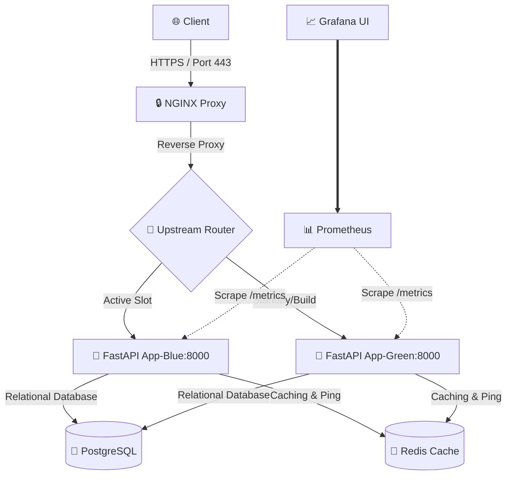

# 🚀 FastAPI Production-Ready Minimal Stack

A premium, highly secure, and production-hardened boilerplate featuring **FastAPI**, **PostgreSQL**, **Redis**, and an **NGINX reverse proxy**. Engineered for high availability, security hardening, and zero-downtime deployment.

---

## 📊 Monitoring Dashboard Mockup


---

## 🏛️ System Architecture



---

## ✨ Features Included

### 1. 📈 Monitoring Setup (Prometheus + Grafana)
* **App Instrumentation**: The FastAPI app automatically collects and publishes system performance metrics at `/metrics` via `prometheus-fastapi-instrumentator`.
* **Telemetry**: Integrated containerized **Prometheus** (Port `9090`) and **Grafana** (Port `3000`) services.
* **Auto-Provisioned**: Grafana automatically loads Prometheus as the default datasource on boot.

### 2. ⚡ Zero-Downtime Blue-Green Deployments
* **Dual Containers**: Configured side-by-side execution slots (`app-blue` and `app-green`).
* **Active-Passive Swap**: Deployments build the inactive slot container, polls the new container's `/health` endpoint until healthy, re-routes Nginx upstream via hot-reload, and shuts down the old slot.
* Run deployment using:
  ```bash
  ./scripts/zero_downtime_deploy.sh
  ```

### 3. 🔒 Security Hardening (Firewall & Fail2ban)
* **Host Protection**: Automated shell scripts to restrict open ports and block hostile clients:
  * **UFW Firewall**: [setup_firewall.sh](scripts/setup_firewall.sh) limits incoming traffic strictly to SSH (`22`), HTTP (`80`), and HTTPS (`443`).
  * **Brute-force Jail**: [setup_fail2ban.sh](scripts/setup_fail2ban.sh) configures fail2ban monitoring for Docker Nginx access and error logs to auto-ban suspicious hosts.

### 4. ☁️ Cloudflare Proxy Integration
* **Real-IP Restoration**: Dynamic Nginx config block [cloudflare.conf](nginx/cloudflare.conf) to accurately restore and log the original client IP (`CF-Connecting-IP`).
* **Cloudflare IP Updater**: Portable Python script [cloudflare_ips.py](scripts/cloudflare_ips.py) to fetch, compile, and update Nginx configurations automatically with Cloudflare's IPv4/IPv6 ranges.

### 5. 💾 Nightly Backups & History Rotation
* **Cron Scheduled**: [setup_backup_cron.sh](scripts/setup_backup_cron.sh) schedules a nightly backup crontab executing at 2:00 AM.
* **7-Day Retention**: Database dumps are gzip-compressed and automatically pruned to retain only the last 7 days of history, safeguarding host disk storage.

---

## 🚀 Quick Start (Local Development)

### 1. Prepare Environment variables
```bash
cp .env.example .env
```

### 2. Launch the Stack
```bash
docker compose up -d --build
```

### 3. Verify Health Checks
* **FastAPI Root**: [http://localhost/](http://localhost/)
* **App Health Endpoint**: [http://localhost/health](http://localhost/health)
* **Metrics Endpoint**: [http://localhost/metrics](http://localhost/metrics)
* **Prometheus Console**: [http://localhost:9090/](http://localhost:9090/)
* **Grafana Interface**: [http://localhost:3000/](http://localhost:3000/) *(Login with `admin` / `admin`)*
