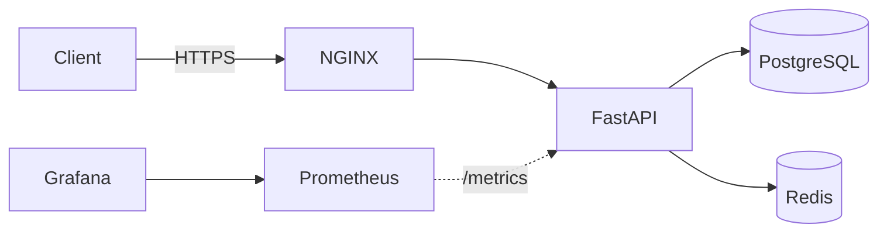

<p align="center">
  
  
  
  
  
  
  
</p>

# FastAPI Production Stack

I put together a minimal but production-ready FastAPI setup with everything I'd actually want on a real deployment:- Postgres, Redis, NGINX reverse proxy, monitoring, automated backups, security hardening, and zero-downtime deploys.

## Architecture



---

## Quick Start

```bash
git clone https://github.com/Rahuljoshi07/Project_1.git
cd Project_1
cp .env.example .env
docker compose up -d --build
```

```bash
curl http://localhost/health
# {"ok": true, "postgres": {"ok": true}, "redis": {"ok": true}}
```

| Service | URL | Credentials |
|:---|:---|:---|
| FastAPI | http://localhost | none |
| Health Check | http://localhost/health | none |
| Prometheus | http://localhost:9090 | none |
| Grafana | http://localhost:3000 | `admin` / `admin` |

<!-- 📸 SCREENSHOT:- take a screenshot of your terminal showing "docker compose ps" 
     with all containers running healthy. Save it as docs/images/docker-ps.png -->
<!--  -->

---

## Features

### 📈 Monitoring

I added [`prometheus-fastapi-instrumentator`](https://github.com/trallnag/prometheus-fastapi-instrumentator) so the app automatically exposes request counts, latency, in-progress requests and response sizes at `/metrics`. Prometheus scrapes every 15s and Grafana comes pre-wired as the default datasource.

<!-- 📸 SCREENSHOT:- take a screenshot of the Grafana dashboard at localhost:3000 
     showing the Prometheus datasource connected. Save as docs/images/grafana-dashboard.png -->
<!--  -->

<details>
<summary>Example metrics output</summary>

```
# HELP http_requests_total Total number of requests by method, status and handler.
# TYPE http_requests_total counter
http_requests_total{handler="/health",method="GET",status="2xx"} 42.0
```
</details>

---

### ⚡ Zero-Downtime Deploys

Two app containers run side by side (blue/green). The deploy script builds the idle one, waits for health checks to pass, swaps NGINX upstream, reloads gracefully, and stops the old container. No dropped requests.

```bash
sudo ./scripts/zero_downtime_deploy.sh
```

<!-- 📸 SCREENSHOT:- take a screenshot of the terminal running zero_downtime_deploy.sh 
     showing the "Zero-Downtime Deployment SUCCESSFUL!" message. Save as docs/images/zero-downtime.png -->
<!--  -->

<details>
<summary>How it works step by step</summary>

```
┌─────────────┐          ┌─────────────────┐
│   NGINX     │──────────│  App Blue       │  ← serving traffic
│  (upstream) │          │  (healthy)      │
└─────────────┘          ├─────────────────┤
                         │  App Green      │  ← idle / rebuilding
                         │  (standby)      │
                         └─────────────────┘
```

1. Detect which slot is currently active
2. Build and start the other slot
3. Poll `/health` until healthy
4. Update `nginx/upstream.conf` to the new slot
5. Reload NGINX (`nginx -s reload`)
6. Stop the old container
</details>

---

### 🔒 Security

I tried to cover the basics that I'd actually do on a real VPS.

```bash
sudo ./scripts/setup_firewall.sh   # UFW firewall
sudo ./scripts/setup_fail2ban.sh   # brute-force protection
```

<!-- 📸 SCREENSHOT:- take a screenshot of "sudo ufw status verbose" showing 
     the active firewall rules. Save as docs/images/firewall-status.png -->
<!--  -->

<details>
<summary>Firewall (UFW) details</summary>

- Default policy:- **deny all incoming**, allow all outgoing
- Opens only **SSH (22)**, **HTTP (80)**, **HTTPS (443)**
- Blocks external access to Prometheus (9090) and Grafana (3000)
</details>

<details>
<summary>Fail2ban jails</summary>

| Jail | Watches | Threshold | Ban time |
|:---|:---|:---|:---|
| SSH | `/var/log/auth.log` | 5 failed logins in 10 min | 1 hour |
| NGINX HTTP auth | NGINX error logs | 3 failed auth attempts in 10 min | 1 hour |
| NGINX bot search | NGINX access logs | 5 exploit-path hits in 30 min | 24 hours |

Check status anytime with `fail2ban-client status`.
</details>

<details>
<summary>NGINX security headers</summary>

| Header | What it does |
|:---|:---|
| `Strict-Transport-Security` | Forces HTTPS for 2 years, including subdomains |
| `X-Frame-Options: DENY` | Blocks iframes (clickjacking protection) |
| `X-Content-Type-Options: nosniff` | Prevents MIME-sniffing |
| `Referrer-Policy: no-referrer` | Stops referrer leaking to other sites |

TLS 1.2/1.3 only, strong ciphers, no legacy SSL.
</details>

---

### ☁️ Cloudflare Integration

If you're behind Cloudflare, NGINX sees Cloudflare's IP instead of your visitors. This script fetches the latest ranges and generates an NGINX config that restores real client IPs:-

```bash
python scripts/cloudflare_ips.py
```

---

### 💾 Automated Backups

```bash
./scripts/backup.sh                    # manual backup
./scripts/restore.sh /path/to/file.gz  # restore
sudo ./scripts/setup_backup_cron.sh    # nightly cron at 2am
```

Dumps are gzipped, and anything older than 7 days gets auto-pruned.

---

## Project Structure

<details>
<summary>Click to expand</summary>

```
.
├── app/
│   ├── main.py                    # FastAPI app with health checks and metrics
│   └── requirements.txt
│
├── nginx/
│   ├── dev.conf                   # local dev config
│   ├── prod.conf                  # TLS + security headers
│   ├── upstream.conf              # blue-green upstream
│   └── cloudflare.conf            # auto-generated real-IP config
│
├── prometheus/
│   └── prometheus.yml
│
├── grafana/provisioning/
│   └── datasources/
│       └── datasource.yml         # auto-provisions Prometheus
│
├── scripts/
│   ├── zero_downtime_deploy.sh
│   ├── setup_firewall.sh
│   ├── setup_fail2ban.sh
│   ├── cloudflare_ips.py
│   ├── backup.sh
│   ├── restore.sh
│   └── setup_backup_cron.sh
│
├── docs/                          # detailed docs
├── .github/workflows/deploy.yml   # CI/CD
├── docker-compose.yml             # dev
├── docker-compose.prod.yml        # prod
├── Dockerfile
└── .env.example
```
</details>

---

## Deployment

Full guide:- [docs/deployment.md](docs/deployment.md)

```bash
sudo certbot certonly --standalone -d your-domain.com
cp .env.example .env   # set APP_ENV=production
docker compose -f docker-compose.prod.yml up -d --build
```

<!-- 📸 SCREENSHOT:- take a screenshot of "curl -k https://your-domain.com/health" 
     showing the healthy JSON response. Save as docs/images/prod-health.png -->
<!--  -->

<details>
<summary>CI/CD with GitHub Actions</summary>

Push to `main` and it auto-deploys via SSH. Set these secrets:-

| Secret | What to put |
|:---|:---|
| `SSH_HOST` | server IP or hostname |
| `SSH_USER` | SSH username |
| `SSH_KEY` | private SSH key |
</details>

---

## Docs

| Doc | What's in it |
|:---|:---|
| [architecture.md](docs/architecture.md) | system diagram |
| [deployment.md](docs/deployment.md) | deployment walkthrough |
| [security.md](docs/security.md) | firewall, fail2ban, TLS |
| [monitoring.md](docs/monitoring.md) | Prometheus and Grafana |
| [backup.md](docs/backup.md) | backup and restore |
| [logging.md](docs/logging.md) | log config |

---

## Environment Variables

| Variable | Default | What it does |
|:---|:---|:---|
| `APP_ENV` | `local` | `local` or `production` |
| `LOG_LEVEL` | `INFO` | Python log level |
| `DATABASE_URL` | `postgresql://appuser:apppass@db:5432/appdb` | Postgres connection |
| `REDIS_URL` | `redis://redis:6379/0` | Redis connection |
