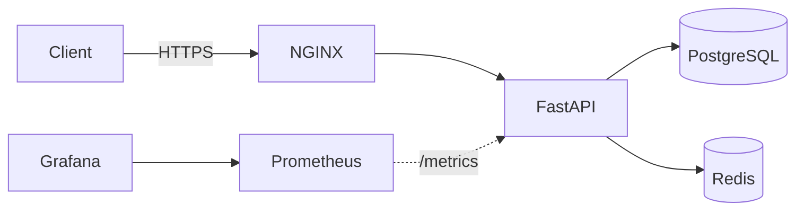

<p align="center">
  
  
  
  
  
  
  
</p>

# FastAPI Production Stack

I put together a minimal but production-ready FastAPI setup with everything I'd actually want on a real deployment:- Postgres, Redis, NGINX reverse proxy, monitoring, automated backups, security hardening, and zero-downtime deploys. The idea was to have a clean starting point that doesn't cut corners.

---

## Architecture



---

## Quick Start

```bash
git clone https://github.com/Rahuljoshi07/Project_1.git
cd Project_1
cp .env.example .env
docker compose up -d --build
```

Then hit these to make sure everything's working:-

```bash
curl http://localhost/
# {"message": "Hello from FastAPI"}

curl http://localhost/health
# {"ok": true, "postgres": {"ok": true}, "redis": {"ok": true}}
```

| Service | URL | Credentials |
|:---|:---|:---|
| FastAPI (via NGINX) | http://localhost/ | none |
| Health Check | http://localhost/health | none |
| Prometheus metrics | http://localhost/metrics | none |
| Prometheus UI | http://localhost:9090 | none |
| Grafana | http://localhost:3000 | `admin` / `admin` |

---

## What's Included

### Monitoring (Prometheus + Grafana)

I added [`prometheus-fastapi-instrumentator`](https://github.com/trallnag/prometheus-fastapi-instrumentator) to the app so it automatically exposes metrics at `/metrics`:- request counts, latency histograms, in-progress requests, response sizes. Prometheus scrapes it every 15s and Grafana comes pre-wired with Prometheus as the default datasource, so you don't need to configure anything after boot.

```
http_requests_total{handler="/health",method="GET",status="2xx"} 42.0
```

---

### Zero-Downtime Blue-Green Deployments

The stack runs two app containers side by side (blue and green). Only one handles traffic at a time. When you deploy, the script builds the inactive one, waits for it to pass health checks, swaps NGINX's upstream, reloads NGINX gracefully, and stops the old container. No dropped requests.

```
┌─────────────┐          ┌─────────────────┐
│   NGINX     │──────────│  App Blue       │  ← serving traffic
│  (upstream) │          │  (healthy)      │
└─────────────┘          ├─────────────────┤
                         │  App Green      │  ← idle / rebuilding
                         │  (standby)      │
                         └─────────────────┘
```

How the deploy script works:-

1. Detect which slot is currently active
2. Build and start the other slot
3. Poll `/health` until the new container reports healthy
4. Update `nginx/upstream.conf` to point at the new slot
5. Reload NGINX (`nginx -s reload`)
6. Stop the old container

```bash
sudo ./scripts/zero_downtime_deploy.sh
```

---

### Security

I tried to cover the basics that I'd actually do on a real VPS. Nothing fancy, just solid defaults.

#### Firewall (UFW)

The script locks down the server to only what's needed:-

```bash
sudo ./scripts/setup_firewall.sh
```

What it does:-
- Sets default policy to **deny all incoming**
- Allows only **SSH (22)**, **HTTP (80)**, **HTTPS (443)**
- Explicitly blocks external access to Prometheus and Grafana ports
- Keeps outgoing traffic open so the server can still pull images, updates, etc.

#### Fail2ban

Handles the brute-force stuff automatically:-

```bash
sudo ./scripts/setup_fail2ban.sh
```

What it does:-
- **SSH jail** :- 5 failed login attempts within 10 minutes = banned for 1 hour
- **NGINX HTTP auth jail** :- watches for repeated auth failures in NGINX error logs, bans after 3 attempts
- **NGINX bot search jail** :- catches bots scanning for common exploit paths (wp-admin, phpmyadmin, etc.), bans after 5 hits for 24 hours

All jails log to syslog so you can check `fail2ban-client status` anytime to see what's been blocked.

#### NGINX Hardening

The production NGINX config (`nginx/prod.conf`) has these headers baked in:-

| Header | What it does |
|:---|:---|
| `Strict-Transport-Security` | Forces browsers to use HTTPS for 2 years, including subdomains |
| `X-Frame-Options: DENY` | Blocks the site from being loaded in iframes (clickjacking protection) |
| `X-Content-Type-Options: nosniff` | Prevents browsers from MIME-sniffing responses |
| `Referrer-Policy: no-referrer` | Stops the browser from sending referrer info to other sites |

TLS is configured to only allow **TLS 1.2 and 1.3** with strong ciphers. No legacy SSL nonsense.

#### What I'd also recommend

These aren't automated in the scripts but worth doing on any real server:-
- Create a non-root SSH user and disable password login
- Set up SSH key-only authentication
- Run containers as non-root where possible
- Rotate secrets/passwords periodically

---

### Cloudflare Integration

If you're running behind Cloudflare, NGINX will see Cloudflare's IP instead of your actual visitors. This script pulls the latest Cloudflare IP ranges and generates an NGINX config that restores the real client IP using the `CF-Connecting-IP` header:-

```bash
python scripts/cloudflare_ips.py
```

The generated `nginx/cloudflare.conf` gets included in the NGINX server block automatically.

---

### Automated Backups

```bash
# manual backup
./scripts/backup.sh

# manual restore
./scripts/restore.sh /backups/appdb_20260602020000.sql.gz

# set up nightly cron (runs at 2am, keeps last 7 days)
sudo ./scripts/setup_backup_cron.sh
```

The backup script dumps Postgres, gzips it, and cleans up anything older than 7 days so you don't fill up the disk.

---

## Project Structure

```
.
├── app/
│   ├── main.py                    # FastAPI app with health checks and metrics
│   └── requirements.txt           # Python deps
│
├── nginx/
│   ├── dev.conf                   # NGINX config for local dev
│   ├── prod.conf                  # NGINX config with TLS + security headers
│   ├── upstream.conf              # dynamic upstream for blue-green switching
│   └── cloudflare.conf            # auto-generated cloudflare real-IP config
│
├── prometheus/
│   └── prometheus.yml             # scrape config
│
├── grafana/provisioning/
│   └── datasources/
│       └── datasource.yml         # auto-provisions Prometheus in Grafana
│
├── scripts/
│   ├── zero_downtime_deploy.sh    # blue-green deploy script
│   ├── setup_firewall.sh          # UFW setup
│   ├── setup_fail2ban.sh          # fail2ban setup
│   ├── cloudflare_ips.py          # fetch cloudflare IP ranges
│   ├── backup.sh                  # pg_dump + gzip + rotation
│   ├── restore.sh                 # restore from backup
│   └── setup_backup_cron.sh       # install nightly cron
│
├── docs/                          # detailed docs for each topic
├── .github/workflows/deploy.yml   # CI/CD pipeline
├── docker-compose.yml             # dev stack
├── docker-compose.prod.yml        # prod stack with TLS
├── Dockerfile                     # Python 3.11 slim
└── .env.example                   # env template
```

---

## Deployment

Full guide:- [docs/deployment.md](docs/deployment.md)

Short version:-

```bash
# get SSL cert
sudo certbot certonly --standalone -d your-domain.com
sudo cp /etc/letsencrypt/live/your-domain.com/*.pem nginx/certs/

# configure
cp .env.example .env
# edit .env, set APP_ENV=production

# launch
docker compose -f docker-compose.prod.yml up -d --build

# verify
curl -k https://your-domain.com/health
```

### CI/CD with GitHub Actions

Push to `main` and it auto-deploys via SSH. You need these secrets in your GitHub repo:-

| Secret | What to put |
|:---|:---|
| `SSH_HOST` | server IP or hostname |
| `SSH_USER` | SSH username |
| `SSH_KEY` | private SSH key |

---

## Docs

| Doc | What's in it |
|:---|:---|
| [architecture.md](docs/architecture.md) | system diagram |
| [deployment.md](docs/deployment.md) | full deployment walkthrough |
| [security.md](docs/security.md) | firewall, fail2ban, TLS notes |
| [monitoring.md](docs/monitoring.md) | Prometheus and Grafana options |
| [backup.md](docs/backup.md) | backup and restore strategy |
| [logging.md](docs/logging.md) | log config and troubleshooting |

---

## Environment Variables

| Variable | Default | What it does |
|:---|:---|:---|
| `APP_ENV` | `local` | `local` or `production` |
| `LOG_LEVEL` | `INFO` | Python log level |
| `DATABASE_URL` | `postgresql://appuser:apppass@db:5432/appdb` | Postgres connection string |
| `REDIS_URL` | `redis://redis:6379/0` | Redis connection string |

---

## Contributing

1. Fork the repo
2. Create a branch (`git checkout -b feature/something`)
3. Commit your changes
4. Push and open a PR
