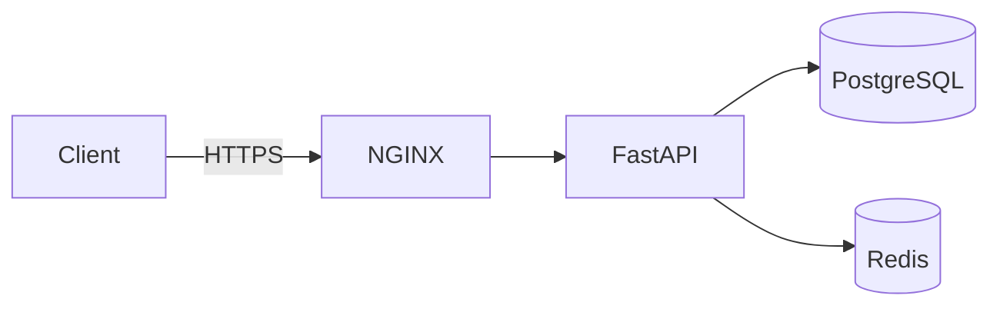

# FastAPI Stack (FastAPI + Postgres + Redis + NGINX)

I put together a minimal FastAPI app with a production-ready container setup: Postgres, Redis, and an NGINX reverse proxy. The goal is to show a clean, deployable baseline with docs and CI/CD in place.

## Quick start (local)

1) Copy the env file

```
cp .env.example .env
```

2) Start everything

```
docker compose up --build
```

3) Test

```
curl http://localhost:8000/health
```

## Production

- Use [docs/deployment.md](docs/deployment.md) for the full deployment steps.
- Use [docs/security.md](docs/security.md) for baseline security hardening.
- Use [docs/backup.md](docs/backup.md) for backups and restore strategy.
- Use [docs/logging.md](docs/logging.md) for logging and troubleshooting.
- Use [docs/monitoring.md](docs/monitoring.md) for simple monitoring options.
- Use [docs/architecture.md](docs/architecture.md) for the diagram.

## Architecture


