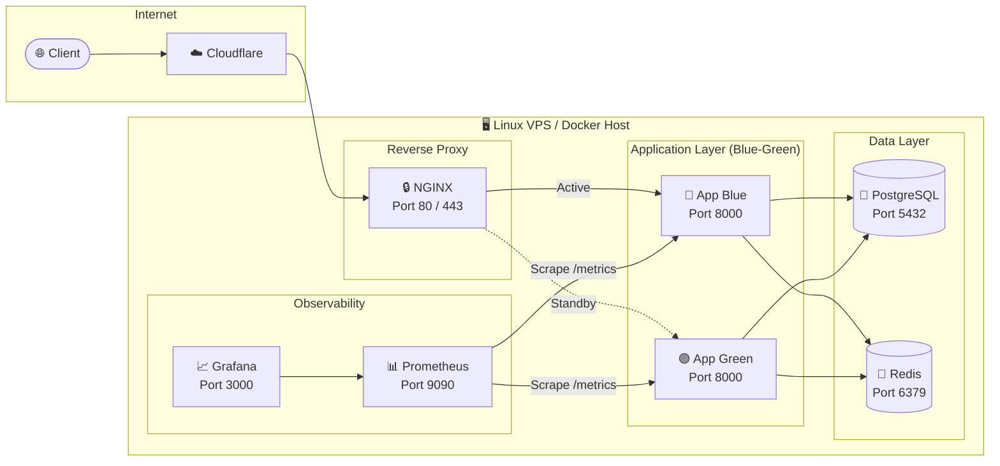

<p align="center">
  
  
  
  
  
  
  
</p>

<h1 align="center">🚀 FastAPI Production Stack</h1>

<p align="center">
  <strong>A production-ready, security-hardened FastAPI boilerplate with zero-downtime deployments,<br/>
  full observability, and automated infrastructure — ready to ship from day one.</strong>
</p>

<p align="center">
  <a href="#-quick-start">Quick Start</a> •
  <a href="#-architecture">Architecture</a> •
  <a href="#-features">Features</a> •
  <a href="#-project-structure">Project Structure</a> •
  <a href="#-deployment">Deployment</a> •
  <a href="#-documentation">Documentation</a>
</p>

---

## 🎯 What Is This?

This project is a **complete, deployable FastAPI application stack** — not just a demo. It includes everything you need to go from local development to production on a Linux VPS:

| What You Get | Why It Matters |
|:---|:---|
| 🐍 **FastAPI** app with health checks | Production-grade API with built-in monitoring |
| 🐘 **PostgreSQL 16** database | Reliable, battle-tested relational storage |
| 🔴 **Redis 7** cache | Fast in-memory caching and session store |
| 🔒 **NGINX** reverse proxy with TLS | Secure entry point with HTTPS & security headers |
| 📊 **Prometheus + Grafana** monitoring | Real-time metrics, dashboards & alerting |
| ⚡ **Blue-Green zero-downtime deploys** | Ship updates without dropping a single request |
| 🛡️ **Firewall + Fail2ban** scripts | Host-level security hardening out of the box |
| ☁️ **Cloudflare** real-IP integration | Accurate client IP logging behind Cloudflare proxy |
| 💾 **Automated nightly backups** | Scheduled PostgreSQL dumps with 7-day retention |
| 🔄 **GitHub Actions CI/CD** | Push to `main` → auto-deploy to your server |

---

## 🏗️ Architecture



### How It Works

1. **Client** sends a request → hits **Cloudflare** (optional CDN/proxy)
2. **NGINX** terminates TLS, adds security headers, restores real client IP
3. Request is routed to the **active application slot** (Blue or Green)
4. **FastAPI** processes the request, using **PostgreSQL** for data and **Redis** for caching
5. **Prometheus** scrapes `/metrics` every 15 seconds → **Grafana** visualizes everything

---

## ⚡ Quick Start

Get the entire stack running locally in **under 60 seconds**:

### Step 1 — Clone & Configure

```bash
git clone https://github.com/Rahuljoshi07/Project_1.git
cd Project_1
cp .env.example .env
```

### Step 2 — Launch Everything

```bash
docker compose up -d --build
```

### Step 3 — Verify

```bash
# Check API root
curl http://localhost/
# → {"message": "Hello from FastAPI"}

# Check full health (Postgres + Redis connectivity)
curl http://localhost/health
# → {"ok": true, "postgres": {"ok": true}, "redis": {"ok": true}}

# Check Prometheus metrics
curl http://localhost/metrics
# → http_requests_total{handler="/health",method="GET",status="2xx"} 1.0
```

### Step 4 — Open Dashboards

| Service | URL | Credentials |
|:---|:---|:---|
| 🐍 FastAPI (via NGINX) | [http://localhost/](http://localhost/) | — |
| ❤️ Health Check | [http://localhost/health](http://localhost/health) | — |
| 📊 Prometheus | [http://localhost:9090/](http://localhost:9090/) | — |
| 📈 Grafana | [http://localhost:3000/](http://localhost:3000/) | `admin` / `admin` |

---

## ✨ Features

### 📈 Monitoring (Prometheus + Grafana)

The FastAPI application is instrumented with [`prometheus-fastapi-instrumentator`](https://github.com/trallnag/prometheus-fastapi-instrumentator) to automatically track:

- **Request count** — by method, handler, and status code
- **Request duration** — latency histograms
- **In-progress requests** — concurrent request tracking
- **Response sizes** — payload size distribution

```
# HELP http_requests_total Total number of requests by method, status and handler.
# TYPE http_requests_total counter
http_requests_total{handler="/health",method="GET",status="2xx"} 42.0
```

Prometheus scrapes these metrics every **15 seconds** and Grafana is **auto-provisioned** with Prometheus as the default datasource — no manual setup required.

---

### ⚡ Zero-Downtime Blue-Green Deployments

The stack runs **two application containers** side-by-side. Only one serves traffic at any time:

```
┌─────────────┐          ┌─────────────────┐
│   NGINX     │──────────│  🔵 App Blue    │  ← Currently serving traffic
│  (upstream) │          │    (healthy)     │
└─────────────┘          ├─────────────────┤
                         │  🟢 App Green   │  ← Idle / being rebuilt
                         │    (standby)    │
                         └─────────────────┘
```

**Deployment flow** (`scripts/zero_downtime_deploy.sh`):

1. 🔨 **Build** the inactive slot with the latest code
2. 🏥 **Health-poll** the new container until `/health` returns `healthy`
3. 🔀 **Swap** NGINX upstream to point at the new container
4. 🔄 **Reload** NGINX gracefully (`nginx -s reload`) — no dropped connections
5. 🛑 **Stop** the old container

```bash
# Deploy with zero downtime
sudo ./scripts/zero_downtime_deploy.sh
```

---

### 🔒 Security Hardening

#### Firewall (UFW)
```bash
sudo ./scripts/setup_firewall.sh
```
- Denies all incoming traffic by default
- Opens only ports **22** (SSH), **80** (HTTP), **443** (HTTPS)
- Blocks external access to Prometheus (9090) and Grafana (3000)

#### Fail2ban
```bash
sudo ./scripts/setup_fail2ban.sh
```
- Protects SSH against brute-force attacks (5 retries → 1 hour ban)
- Monitors NGINX logs for malicious bot patterns
- Auto-bans IPs with excessive failed HTTP requests

#### NGINX Security Headers
The production NGINX config includes:
- `Strict-Transport-Security` (HSTS) — force HTTPS
- `X-Frame-Options: DENY` — prevent clickjacking
- `X-Content-Type-Options: nosniff` — prevent MIME sniffing
- `Referrer-Policy: no-referrer` — privacy protection
- TLS 1.2/1.3 only with strong cipher suites

---

### ☁️ Cloudflare Integration

When your app is behind Cloudflare, NGINX sees Cloudflare's IP instead of the real client IP. We fix that:

```bash
# Fetch latest Cloudflare IP ranges and generate NGINX config
python scripts/cloudflare_ips.py
```

This generates `nginx/cloudflare.conf` which tells NGINX to:
- Trust Cloudflare's IPv4 and IPv6 ranges
- Use `CF-Connecting-IP` header to restore the real client IP
- Log actual visitor IPs instead of Cloudflare proxy IPs

---

### 💾 Automated Backups

#### Manual Backup & Restore
```bash
# Create a backup
./scripts/backup.sh
# → Backup written to /backups/appdb_20260602020000.sql.gz

# Restore from backup
./scripts/restore.sh /backups/appdb_20260602020000.sql.gz
```

#### Scheduled Nightly Backups
```bash
sudo ./scripts/setup_backup_cron.sh
```
- Installs a cron job running **nightly at 2:00 AM**
- Creates gzip-compressed PostgreSQL dumps
- **Auto-prunes** backups older than 7 days to prevent disk exhaustion

---

## 📁 Project Structure

```
Project_1/
├── app/
│   ├── main.py                    # FastAPI application with health checks & metrics
│   └── requirements.txt           # Python dependencies
│
├── nginx/
│   ├── dev.conf                   # NGINX config for local development
│   ├── prod.conf                  # NGINX config with TLS, HSTS & security headers
│   ├── upstream.conf              # Dynamic upstream for Blue-Green switching
│   └── cloudflare.conf            # Auto-generated Cloudflare real-IP restoration
│
├── prometheus/
│   └── prometheus.yml             # Prometheus scrape configuration
│
├── grafana/
│   └── provisioning/
│       └── datasources/
│           └── datasource.yml     # Auto-provision Prometheus in Grafana
│
├── scripts/
│   ├── zero_downtime_deploy.sh    # Blue-Green zero-downtime deployment
│   ├── setup_firewall.sh          # UFW firewall hardening
│   ├── setup_fail2ban.sh          # Fail2ban brute-force protection
│   ├── cloudflare_ips.sh          # Cloudflare IP range fetcher (shell)
│   ├── cloudflare_ips.py          # Cloudflare IP range fetcher (Python)
│   ├── backup.sh                  # PostgreSQL backup with 7-day retention
│   ├── restore.sh                 # PostgreSQL restore from backup
│   └── setup_backup_cron.sh       # Install nightly backup cron job
│
├── docs/
│   ├── architecture.md            # System architecture diagram
│   ├── deployment.md              # Full deployment guide
│   ├── security.md                # Security hardening checklist
│   ├── monitoring.md              # Monitoring setup options
│   ├── backup.md                  # Backup & restore strategy
│   └── logging.md                 # Logging configuration
│
├── .github/
│   └── workflows/
│       └── deploy.yml             # GitHub Actions CI/CD pipeline
│
├── docker-compose.yml             # Development stack (with monitoring)
├── docker-compose.prod.yml        # Production stack (with TLS & certs)
├── Dockerfile                     # Python 3.11 slim container
├── .env.example                   # Environment variable template
└── .dockerignore                  # Docker build exclusions
```

---

## 🚢 Deployment

### Production (Linux VPS)

Full deployment guide: [docs/deployment.md](docs/deployment.md)

```bash
# 1. Set up SSL (Let's Encrypt)
sudo certbot certonly --standalone -d your-domain.com
sudo cp /etc/letsencrypt/live/your-domain.com/*.pem nginx/certs/

# 2. Configure environment
cp .env.example .env
# Edit .env → set APP_ENV=production

# 3. Launch production stack
docker compose -f docker-compose.prod.yml up -d --build

# 4. Verify
curl -k https://your-domain.com/health
```

### GitHub Actions (Automated)

Push to `main` → automatically deploys to your server via SSH.

Required GitHub Secrets:

| Secret | Description |
|:---|:---|
| `SSH_HOST` | Your server's IP or hostname |
| `SSH_USER` | SSH username |
| `SSH_KEY` | Private SSH key for authentication |

---

## 📚 Documentation

| Document | Description |
|:---|:---|
| 📐 [Architecture](docs/architecture.md) | System design diagram |
| 🚢 [Deployment](docs/deployment.md) | Step-by-step production deployment |
| 🔒 [Security](docs/security.md) | Firewall, fail2ban, and TLS hardening |
| 📊 [Monitoring](docs/monitoring.md) | Prometheus & Grafana setup guide |
| 💾 [Backup](docs/backup.md) | Backup strategy and restore procedures |
| 📝 [Logging](docs/logging.md) | Log levels and troubleshooting |

---

## 🛠️ Environment Variables

| Variable | Default | Description |
|:---|:---|:---|
| `APP_ENV` | `local` | Environment name (`local`, `production`) |
| `LOG_LEVEL` | `INFO` | Python log level (`DEBUG`, `INFO`, `WARNING`, `ERROR`) |
| `DATABASE_URL` | `postgresql://appuser:apppass@db:5432/appdb` | PostgreSQL connection string |
| `REDIS_URL` | `redis://redis:6379/0` | Redis connection string |

---

## 🤝 Contributing

1. Fork the repository
2. Create a feature branch (`git checkout -b feature/amazing-feature`)
3. Commit your changes (`git commit -m 'feat: add amazing feature'`)
4. Push to the branch (`git push origin feature/amazing-feature`)
5. Open a Pull Request

---

<p align="center">
  Built with ❤️ using FastAPI, Docker, and good engineering practices.
</p>
